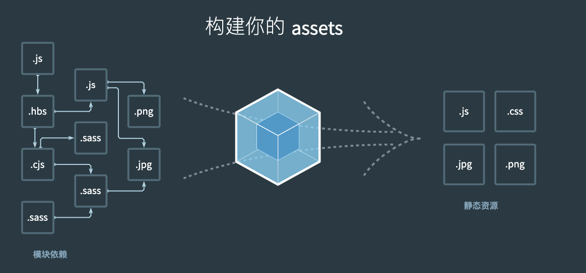
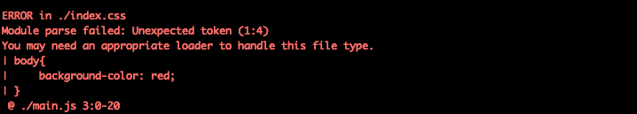

## webpack

组件化开发 vue-cli

webpack 前端工具

前端中的任何资源都称为模块，模块是什么？css js 图片 脚本 表


```本质上，**webpack** 是一个用于现代 JavaScript 应用程序的_静态模块打包工具_。当 webpack 处理应用程序时，它会在内部构建一个 [依赖图(dependency graph)](https://webpack.docschina.org/concepts/dependency-graph/)，此依赖图对应映射到项目所需的每个模块，并生成一个或多个 *bundle*。```



### 历史介绍

-   2009年初，commonjs规范还未出来，此时此刻前端开发人员编写的代码都是非模块化的

    -   那个时候开发人员经常需要十分留意文件加载顺序所带来的依赖问题

    -   ```javascript
        script
        script
        
        
        同步加载，中间有一个环节有问题，就容易造成阻塞
        ```

-   与此同时 nodejs开启了js全栈大门，而requerejs在国外也带动着前端逐步实现模块化

    -   同时国内seajs也进行了大力推广
    -   AMD规范 async module Define，具体实现是requirejs define（'模块id',[模块依赖1,模块依赖2],function(){return ;}) ,ajax请求文件并加载
    -   Commjs || CMD common module Define 规范seajs 淘宝玉伯
        -   commonjs和cmd非常相似的
            -   cmd require/module.exports
        -   commonjs是js在后端语言的规范: 模块、文件操作、操作系统底层
        -   CMD仅仅是模块定义
    -   UMD通用模块定义吗，一种既能兼容amd也能兼容commonjs，也能兼容浏览器环境运行的万能代码

-   npm/bower集中包管理的方式备受青睐，12年browserify/webpack诞生

    -   Npm 是可以下载后端的js代码47500个包
    -   bowwer只能下载前端的js代码, bower在下载bootstrap的时候会自动的下载jquery
    -   browserify解决让require可以运行在浏览器，分析require的关系，组装代码
    -   webpack打包工具，占市场主流

    

CMD在nodejs的环境下

通过module.exports = 变量

通过require('./time.js')

vue更推荐大家使用es6的module

https://es6.ruanyifeng.com/#docs/module

### 模块实现

#### 1.下载webpack为项目开发依赖

cnpm i webpack@3.12.0 -D

#### 2.创建main.js作为项目的入口文件

```javascript
import Vue from '../../vue.js'
import App from './App.js'

new Vue({
    el:'#app',
    data(){
        return {
            
        }
    },
    template:`<App />`,
    components:{
        App
    }
})
```


#### 3.创建一个App.js

```javascript
let App ={
    template:`
        <div>
            我是App组件111112222
        </div>
    `
}
// 1.声明并导出
export var num =2; // 作为一整个对象key导出

// 2.声明再导出
var num2 =4;
export {num2};

// 3.抛出一个函数
export function add(x,y){
    return console.log(x+y);
}

// 4.抛出一个对象
export default App;
```


#### 4.在package.json文件中配置如下：

```javascript
{
  "name": "01-module_deep",
  "version": "1.0.2",
  "description": "",
  "main": "main.js",
  "scripts": {
    "dev": "webpack --config ./webpack.dev.config.js",
    "build": "webpack --config ./webpack.pro.config.js"
  },
  "author": "steven",
  "license": "ISC",
  "devDependencies": {
    "css-loader": "^5.0.1",
    "style-loader": "^2.0.0",
    "webpack": "^5.17.0",
    "webpack-cli": "^4.4.0"
  }
}
```

#### 5.新建一个index.html，script脚本引入打包完成的bundle.js如下：

```javascript
<!DOCTYPE html>
<html lang="zh">
<head>
    <meta charset="UTF-8">
    <meta name="viewport" content="width=device-width, initial-scale=1.0">
    <meta http-equiv="X-UA-Compatible" content="ie=edge">
    <title></title>
</head>
<body>
    <div id="app">
        
    </div>
    <script src="./dist/bundle.js"></script>
</body>
</html> 
```

### webpack编译之后的build.js文件解读

#### 		webpack打包模块的源码 执行顺序

​				1.把所有模块的代码放入到函数中，用一个数组保存起来

​				2.根据require时传入的数组索引，能知道需要哪一段代码

​				3.从数组中，根据索引取出包含我们代码的函数

​				4.执行该函数，传入一个对象module exports

​				5.我们的代码，按照约定，正好是用module.exports = 'xxxx'进行赋值

​				6.调用函数结束后，module.exports从原来的空对象，就有值了

​				7.最终return module.exports作为require函数的返回值

### webpack.config.js文件配置

-   entry是一个对象，程序的入口
    -   key:随意写
    -   Value:入口文件
-   output是一个对象，程序的入口
    -   key:filename
    -   value:生成的build.js
-   module模块（对象）
    -   loaders '[]'
        -   存在一些loader  ```{test:正则,loader:'style-loader|css-loader'}```

#### 配置文件webpack.config.js的修改

​		修改配置文件名为:webpack.dev.config.js和webpack.pro.config.js

#### 在package.json文件中修改

```javascript
  "scripts": {
    "dev": "webpack --config ./webpack.dev.config.js",
    "build": "webpack --config ./webpack.pro.config.js"
  }
```


### css文件处理

#### es6模块导入

```javascript
import './main.css'
```

#### 编译之后报错




对于webpack来说，css文件也是一个模块，但是像这样的文件，webpack得需要loaders去处理这些文件

#### 下载并配置

```npm i css-loader style-loader -D```

cnpm i webpack@5.17.0 -D

cnpm i css-loader style-loader -D

cnpm install -D webpack-cli

npm run dev

webpack: 3.12.0版本

```javascript
module:{
    loaders:[
        {
            // 遇到后缀为.css的文件，webpack先用css-loader加载器去解析这个文件
            // 最后计算完的css，将会使用style-loader生成一个内容为最终解析完的css代码的style标签，放到head标签里
            // webpack在打包过程中，遇到后缀为css的文件，就会使用style-loader的css-loader去加载这个文件
        	test:/\.css$/,
            loader:'style-loader!css-loader'
        }
    ]
}
```

webpack: 5.17.0版本

```javascript
module.exports = {
    entry:{
        'main':'./main.js'
    },
    output:{
        'filename':'./bundle.js'
    },
    watch:true,
    mode: 'development',
    module: {
        rules: [
          {
            test: /\.css$/i,
            use: ["style-loader", "css-loader"],
          },
        ],
      },
}
```

### 图片文件的处理

#### App.js导入图片资源

#### 下载处理图片loader模块

#### 添加loader的配置

### html-webpack-plugin插件的使用


