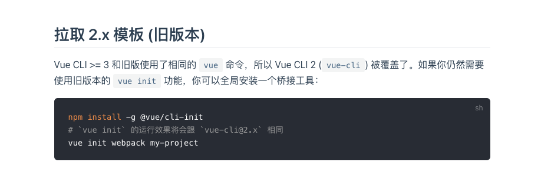
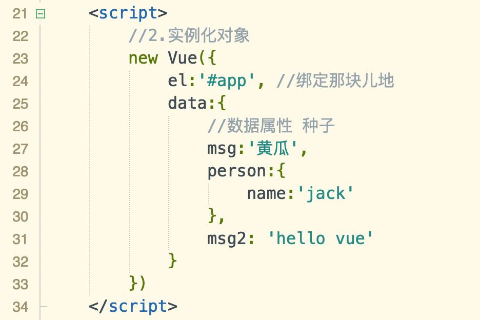
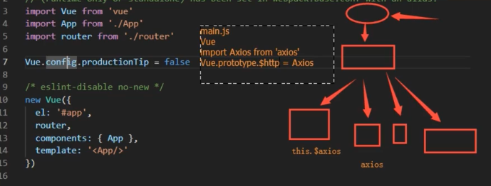

## 内容回顾

### ref

- 给标签绑定ref属性，获取的是当前DOM对象
- 给组件绑定ref属性，获取的是组件实例对象

this.$refs.abc.$parent

this.$refs.abc.$root

this.$refs.abc.$children

### DIR脚手架 cli

#### 前端中的module

A模块依赖B模块

```javascript
b.js
export const a = 5;
export function add(){}
export default obj
```

```javascript
a.js
import * as obj from './b.js'
```

webpack(前端工作，项目上线之前，对整个前端项目优化 )

- entry整个项目中程序入口（main.js或index.js)
- output 输出的出口
- loader 加载器对es6代码的解析 
  - babel-loader css-loader 解析css文件
  - style-loader 将css代码添加一个style标签插入header标签中
  - ul-loader
- plugins html-webpack-plugin uglify

babel是一个解析器

### 使用vue-cli

- 电脑上，linux unix等安装nodejs，npm 包管理器

- ```javascript
  npm install -g @vue/cli
  vue -V 查看当前版本
  vue -V
  You are using Node v13.8.0.
  Node.js 13.x has already reached end-of-life and will not be supported in future major releases.
  It's strongly recommended to use an active LTS version instead.
  @vue/cli 4.5.8
  ```

- 

- ```javascript
  npm install -g @vue/cli-init
  # `vue init` 的运行效果将会跟 `vue-cli@2.x` 相同
  vue init webpack my-project // 生成项目
  		 模板名字  项目名字
  ```

- 先看清楚 当前终端中的根目录是哪个，如果不是my-project，一定要切到当前目录下，然后再执行```npm install```

- 运行项目 npm run dev 加载package.json配置文件


## 今日内容

```javascript
// Content.vue
<template>
  // 当前组件的结构
  <div>
    //指令系统 数据驱动视图
  </div>
</template>

<script>
    // 当前组件的业务逻辑
  export default {
	name: 'steven',//当前组件注册全局组件时，作为vue.component()
    // 等于实例化对象
	data(){
      return {
      	  msg:'steven'
      }
  }
</script>
// 当前组件样式
<style scoped>

</style>
```




### axios**

jquery ajax

Axios 是一个基于 promise 的 HTTP 库，可以用在浏览器和 node.js 中。

http://www.axios-js.com/

https://www.kancloud.cn/yunye/axios/234845

https://es6.ruanyifeng.com/#docs/promise

cnpm i axios -S



将axios挂载到vue的原型上，那么在各个组件中都能使用，因为面向对象（继承）

### vuex**

### 权限控制

### vue-cookie

### localStorage

### sessionStorage


